# GQLS-CLI Technical Design and Scanner Walkthrough

## 1. Executive Summary

GQLS-CLI is a Go command-line GraphQL vulnerability scanner. The executable exposes a Cobra `gqls scan` command, loads scan configuration from defaults, YAML, environment variables, and CLI flags, builds multiple HTTP clients for authenticated, base, and anonymous probing, extracts or reconstructs a GraphQL schema, runs registered checks, aggregates findings, and renders terminal, TXT, JSON, or SARIF reports.

The scanner is intentionally modular:

- `cmd/gqls` owns CLI orchestration and lifecycle.
- `pkg/config` owns configuration and identity parsing.
- `pkg/transport` owns HTTP/WebSocket request execution, default headers, timeout, response capture, and rate limiting.
- `pkg/schema` owns endpoint discovery, auth probing, introspection, field-suggestion harvesting, normalization, sensitivity tagging, and schema helper APIs.
- `pkg/scanner/checks` owns the vulnerability check interface, registry, shared runtime context, and concrete checks.
- `pkg/scanner/authz`, `pkg/scanner/inject`, `pkg/scanner/oob`, and `pkg/scanner/fingerprint` are support packages for authorization, injection, OOB callback, and engine/CVE intelligence.
- `pkg/reporter` owns result serialization and human-readable output.
- `pkg/domain` is the dependency-leaf type model shared by CLI, checks, transport, and reporters.

Uncertainty: this document is based on source-level review of the repository as committed at the time it was written. It does not execute probes against a live GraphQL server, so operational behavior that depends on server-specific responses is documented from the implemented code paths and tests rather than observed production traffic.

## 2. Repository Overview

### Build and runtime

- Module: `github.com/gqls-cli/gqls`.
- Language/toolchain: Go 1.24 with toolchain 1.24.7.
- CLI framework: Cobra/Viper.
- Main external runtime dependencies include Cobra, Viper, Charmbracelet/Lipgloss, coder/websocket, testify for tests, and `golang.org/x/time/rate` for throttling.
- Dockerfile builds/runs the CLI container.
- GitHub Actions define CI/release workflows.

### Directory tree

```text
.
├── cmd/gqls/                         # CLI entrypoint, scan orchestration, progress UI, CLI tests
├── docs/                             # Existing analysis, web index, implementation tickets, this design doc
│   └── tickets/                      # Planned/implemented vulnerability story docs by check family
├── pkg/config/                       # ScanConfig, Viper/Cobra/env loading, identity parsing
├── pkg/domain/                       # Shared DTOs: Severity, Category, Finding, CheckResult, CurlRequest
├── pkg/ingest/curl/                  # Pure-Go curl parser for reproducing user request context
├── pkg/reporter/                     # terminal, TXT, JSON, SARIF reporters
├── pkg/scanner/authz/                # Identity model, authz response classifier/differential oracle/redaction
├── pkg/scanner/checks/               # Check registry and all vulnerability checks
├── pkg/scanner/fingerprint/          # GraphQL engine fingerprinting and curated CVE/advisory data
├── pkg/scanner/inject/               # Injection surface enumeration and boolean/error/timing oracles
├── pkg/scanner/oob/                  # Out-of-band callback token/poller abstraction
├── pkg/schema/                       # Schema model, extractor, endpoint discovery, harvester, normalizer, sensitivity
├── pkg/schema/surface/               # Schema-derived authorization and input-surface helpers
└── pkg/transport/                    # HTTP and WebSocket transport clients
```

### File responsibility map

| Path/family | Responsibility |
|---|---|
| `.github/workflows/ci.yml`, `.github/workflows/release.yml` | CI and release automation. |
| `.goreleaser.yaml` | Release packaging configuration. |
| `Dockerfile` | Container image build/run definition. |
| `README.md` | User-facing quick-start and feature documentation. |
| `docs/SECURITY_PLATFORM_ANALYSIS.md` | Higher-level security platform analysis. |
| `docs/index.html` | Static documentation or landing page asset. |
| `docs/tickets/*.md` | Per-check implementation tickets/acceptance criteria; useful for maintaining check intent. |
| `cmd/gqls/main.go` | Process entrypoint; calls `rootCmd.Execute()` and exits non-zero on errors. |
| `cmd/gqls/scan.go` | Defines `gqls scan`, all scan flags, lifecycle orchestration, curl ingestion, client construction, schema extraction, check loop, report rendering, fail threshold handling. |
| `cmd/gqls/progress.go` | Live/stderr progress rendering for selected checks. |
| `pkg/config/config.go` | Configuration struct, Viper precedence, CLI/env binding, header resolution, identity/seed parsing. |
| `pkg/domain/domain.go` | Shared severity/category/finding/check-result/curl-request model. |
| `pkg/ingest/curl/parser.go` | Safe parser for Bash/CMD curl strings; extracts method, URL, headers, body. |
| `pkg/reporter/reporter.go` | Reporter interface, JSON reporter, SARIF wrapper factory. |
| `pkg/reporter/terminal.go` | ANSI terminal report renderer. |
| `pkg/reporter/txt.go` | Plain text report renderer. |
| `pkg/reporter/sarif.go` | SARIF 2.1.0 data structures and marshal logic. |
| `pkg/scanner/checks/base.go` | Shared `CheckContext`, `Check` interface, global check registry, fingerprint generation. |
| `pkg/scanner/checks/gql001`-`gql012` | Core GraphQL misconfiguration and baseline vulnerability checks. |
| `pkg/scanner/checks/gqla*` | Authorization/authentication family checks. |
| `pkg/scanner/checks/gqld*` | Denial-of-service/resource-amplification family checks. |
| `pkg/scanner/checks/gqli*` | Injection family checks. |
| `pkg/scanner/checks/gqlm*` | Misconfiguration/fingerprinting/security-header family checks. |
| `pkg/scanner/authz/*.go` | Multi-identity authorization comparison, response classification, leak redaction. |
| `pkg/scanner/inject/*.go` | Enumerates injectable schema points, renders injected operations, compares differential/error/timing signals. |
| `pkg/scanner/oob/oob.go` | Mints collaborator tokens and abstracts polling for DNS/HTTP callbacks. |
| `pkg/scanner/fingerprint/*.go` | Identifies GraphQL engines and maps detected engine/version to curated advisories. |
| `pkg/schema/model.go` | GraphQL schema in-memory model and helper query methods. |
| `pkg/schema/extractor.go` | URL normalization, endpoint discovery, auth probe, full/minimal introspection, harvester fallback. |
| `pkg/schema/extractor_discovery.go` | Candidate GraphQL endpoint discovery. |
| `pkg/schema/harvester.go` | Field-suggestion based schema harvesting fallback. |
| `pkg/schema/normalizer.go` | Converts raw introspection JSON to the internal `Schema`. |
| `pkg/schema/sensitivity.go` | Scores/tags sensitive schema fields. |
| `pkg/schema/surface/surface.go` | Higher-level schema surface helpers for authorization/injection candidate selection. |
| `pkg/transport/client.go` | Rate-limited HTTP client, default header injection, request/response buffering. |
| `pkg/transport/ws.go` | WebSocket GraphQL transport helpers for subscription checks. |
| `*_test.go` files | Unit tests for the adjacent packages/checks and behavioral specifications for expected vulnerable/protected paths. |

## 3. Architecture Overview

### Architectural layers

1. **CLI layer (`cmd/gqls`)**: defines flags, config ingestion, scan orchestration, progress, and exit status.
2. **Configuration layer (`pkg/config`, `pkg/ingest/curl`)**: merges static config, env, CLI flags, curl request context, and identity definitions.
3. **Transport layer (`pkg/transport`)**: executes HTTP/WebSocket requests with headers, timeout, latency capture, and rate limiting.
4. **Discovery/schema layer (`pkg/schema`)**: turns a target URL into an internal GraphQL schema when possible.
5. **Scanner engine (`pkg/scanner/checks`)**: registry + `CheckContext` + concrete checks.
6. **Support engines (`authz`, `inject`, `oob`, `fingerprint`, `schema/surface`)**: reusable detection primitives.
7. **Domain/reporting layer (`pkg/domain`, `pkg/reporter`)**: stores findings/results and renders them.

### Main data contracts

- `config.ScanConfig`: target, headers, check filters, timeouts, rate limits, output, false positives, authz identities, WebSocket/OOB options, and curl body.
- `checks.CheckContext`: target, schema, full/base/anonymous clients, parsed curl request, identities, mutation gates, seeds, headers, WebSocket URL, and OOB poller.
- `schema.Schema`: extracted schema plus metadata such as introspection/auth/endpoint-discovery/probe counts.
- `domain.Finding`: risk, category, evidence, repro request/body, fingerprint, confidence, CWE, OWASP.
- `domain.CheckResult`: per-check status, pass probes, findings, error, duration, probe count.
- `reporter.ScanResult`: full scan aggregate.

## 4. Folder-by-Folder Breakdown

### `cmd/gqls`

Purpose: entrypoint and orchestration. `main.go` invokes the root Cobra command. `scan.go` creates the `scan` subcommand, declares every CLI flag, and implements the scanner lifecycle. `progress.go` gives live terminal progress without contaminating machine-readable stdout output.

Inputs: CLI args, config files, environment variables, curl strings/files. Outputs: terminal/TXT/JSON/SARIF report, optional output file, process exit code.

Risks: small changes here affect every run. Header/client separation is security-sensitive because checks intentionally choose full, base, or anonymous clients depending on whether authentication context should be included.

### `pkg/config`

Purpose: produce a validated-ish `ScanConfig`. Precedence is defaults, optional YAML config, environment variables, then CLI flags. It also parses multi-value flags such as headers, checks, identities, mutation allowlists, and authz seeds.

Inputs: Cobra command, Viper instance, OS environment. Outputs: `*ScanConfig` and resolved header maps.

Extension points: add fields to `ScanConfig`, bind Viper/env/flags, update README/tests.

### `pkg/domain`

Purpose: shared, import-cycle-safe DTOs. It should remain a dependency leaf.

Risks: changing JSON shape or severity ordering changes reports, fail thresholds, tests, and external integrations.

### `pkg/transport`

Purpose: make active probes deterministic and auditable. HTTP requests are buffered, default headers injected, rate limiter honored, latency captured, and response bodies read fully.

Important behavior: default `Authorization` overrides a request's existing Authorization header; other defaults only fill missing request headers. There are currently no scanner-level retry loops in the HTTP client.

### `pkg/schema`

Purpose: discover endpoint/schema before checks run. The extractor normalizes URL, discovers `/graphql`-style paths for root URLs, probes unauthenticated/authenticated access with `{ __typename }`, attempts full introspection, falls back to minimal introspection and field-suggestion harvesting, and records metadata.

Extension points: add endpoint candidates, add alternative schema loaders, improve normalizer, extend sensitivity rules.

### `pkg/scanner/checks`

Purpose: implement vulnerabilities. Every check implements `Check`, registers itself in `init()` with `MustRegister`, and is invoked by the scan loop if selected and if schema requirements are met.

Extension points: add a new `gqlXYZ_slug.go` file, implement metadata and `Run`, add tests, set CWE/OWASP/confidence/fingerprint, and register in `init()`.

### `pkg/scanner/authz`

Purpose: differential authorization testing primitives. It models identities, appends anonymous users, sorts/pairs identities, classifies authz response classes, compares responses, and redacts leaked sensitive values.

### `pkg/scanner/inject`

Purpose: generic injection primitives: enumerate schema leaves, render GraphQL operations with injected values, compare body equivalence/error signals, and measure timing effects robustly.

### `pkg/scanner/oob`

Purpose: blind injection/SSRF support. It creates unique DNS-safe tokens under an operator domain and delegates callback polling to a pluggable `PollFunc`/`Poller` implementation.

### `pkg/scanner/fingerprint`

Purpose: extract GraphQL engine/version signals and map them to curated advisories used by misconfiguration/CVE checks.

### `pkg/reporter`

Purpose: convert `ScanResult` and `Finding` data to terminal, TXT, JSON, and SARIF.

## 5. Module Documentation

| Package | Purpose | Inputs | Outputs | Public interfaces | Private helpers | Depends on | Called by | Calls | Extension points | Risks |
|---|---|---|---|---|---|---|---|---|---|---|
| `cmd/gqls` | CLI lifecycle | Args/env/config/curl | Reports/exit code | Cobra commands | `applyCurlInput`, `buildIdentities`, filters | all core packages | OS entrypoint | config, schema, checks, reporter | add commands/flags | auth header semantics, fail-on behavior |
| `pkg/config` | Config load/merge | Viper/Cobra/env | `ScanConfig` | `Load`, `ResolveHeaders`, `ResolveIdentityHeaders` | identity/seed parsers, dedupe | Cobra, Viper | CLI | OS env | add config keys | precedence regressions |
| `pkg/domain` | Shared types | n/a | DTOs | `Severity`, `Finding`, `CheckResult`, `CurlRequest` | `Clone`, parsing | stdlib only | nearly all packages | stdlib | add report fields | breaking output schema |
| `pkg/ingest/curl` | Parse curl safely | raw string/file content | `CurlRequest` | `Parse`, `NormalizeCurlInput` | tokenizer/quote/header helpers | domain | CLI | stdlib | support more curl flags | malformed shell edge cases |
| `pkg/transport` | Execute probes | `http.Request` | `Response` | `NewClient`, `Do`, WS helpers | rate/header/body helpers | x/time, websocket | schema/checks | net/http/websocket | retries, proxies | auth override behavior |
| `pkg/schema` | Schema discovery/model | target URL/client | `Schema` | `Extractor`, `Schema` helpers, `Normalize` | endpoint discovery, harvester, sensitivity | transport | CLI/checks | transport | alternate discovery | active probing assumptions |
| `pkg/schema/surface` | Candidate derivation | schema | fetchers/ops/values | surface funcs | type walkers | schema | authz/injection checks | schema | richer heuristics | false candidate selection |
| `pkg/scanner/checks` | Vulnerability engine | `CheckContext` | `CheckResult` | `Check`, `All`, `MustRegister` | per-check helpers | domain, transport, schema, support pkgs | CLI | transport/schema/support | new checks | active-scan safety |
| `pkg/scanner/authz` | Differential authz | identities/responses | classes/diffs | `Identity`, `Pairs`, `Compare`, `Classify` | redaction/masking | transport | authz checks | stdlib | new diff modes | PII handling |
| `pkg/scanner/inject` | Injection primitives | schema/responses/samplers | points/rendered docs/oracle results | `Points`, `Render`, `BodyEquivalent`, `ErrorSignal`, `TimingOracle` | walkers/median/MAD | schema, transport | injection checks | stdlib | payload families | false positives from unstable apps |
| `pkg/scanner/oob` | OOB callback correlation | collaborator domain | tokens/hits | `Poller`, `Client` | random label, summary | stdlib | injection/SSRF checks | pluggable backend | real backend integration | blind callback observability |
| `pkg/scanner/fingerprint` | Engine/CVE intel | headers/bodies/version | fingerprints/advisories | fingerprint/advisory APIs | matchers/range parsers | domain | GQL-M checks | stdlib | more engines/CVEs | stale vulnerability intel |
| `pkg/reporter` | Report rendering | `ScanResult` | terminal/TXT/JSON/SARIF | `Reporter`, `New` | per-format renderers | domain, schema | CLI | stdlib | new formats | compatibility of JSON/SARIF |

## 6. Complete Execution Flow

1. `main()` calls `rootCmd.Execute()` and exits code 1 when an error is returned.
2. Package initialization registers `scan` on the root command.
3. `newScanCmd()` defines flags for URL, headers, selected/skipped checks, output, fail threshold, timeout, rate limit, config, curl ingestion, authorization identities, mutation gates, authz seeds/login op, WebSocket URL, and OOB domain.
4. `runScan()` creates a fresh Viper instance and calls `config.Load()`.
5. CLI-only headers are copied before curl ingestion so that a later base client can exclude curl-file credentials.
6. `applyCurlInput()` reads `--curl` or `--curl-file`, parses it, uses the curl URL if `--url` was omitted, merges curl headers below CLI headers, and stores curl body.
7. `runScan()` enforces that a target URL exists after curl ingestion.
8. Headers are env-expanded. Three clients are created:
   - full client: curl + CLI headers;
   - base client: CLI-only headers;
   - anonymous client: no headers.
9. Authorization identities are converted into dedicated clients and anonymous identity is appended when identities exist.
10. Registered checks are fetched and filtered by allow/deny lists.
11. Schema extraction runs before checks. If curl input was used and full-client extraction fails, extraction is retried with the base client.
12. `CheckContext` is constructed with target, schema, clients, parsed curl, identity controls, headers, WebSocket, and optional OOB poller.
13. The scan loop starts each selected check. Schema-required checks are skipped if no schema exists. Other checks execute `Run(context.Background(), checkCtx)`.
14. Each check returns `CheckResult`; the orchestrator sets duration/check ID/ran status, accumulates probe counts, check results, and findings.
15. False-positive fingerprints from config are suppressed.
16. A `reporter.ScanResult` is built.
17. Output writer is selected; output files force `noColor`.
18. `reporter.New()` validates the requested format and creates a renderer.
19. `RenderReport()` writes results.
20. If `--fail-on` is not `none`, findings at or above threshold return the sentinel `failOnThresholdError`, causing `main()` to exit 1 without duplicate error text.

## 7. Request Lifecycle

Representative request: full introspection during schema acquisition.

1. `schema.Extractor.Extract()` calls `sendIntrospection(endpoint, FullIntrospectionQuery)`.
2. `sendIntrospection()` wraps the query as JSON under the `query` property, creates a POST request, sets `Content-Type: application/json`, and forces `Accept-Encoding: identity` to preserve readable response bodies.
3. The configured `transport.Client.Do()` buffers the request body so reporters/checks can read it later.
4. The client injects default headers. Authorization from default headers overrides any existing request Authorization; other headers fill only when the request lacks that header.
5. The client waits on its token-bucket rate limiter. If the request context is cancelled, it returns before sending.
6. The underlying `http.Client` applies its timeout. There is no explicit retry in `transport.Client.Do()`.
7. The response body is fully read, latency is captured, and the original request body is reset for later evidence/reporting.
8. `sendIntrospection()` requires HTTP 200 and unmarshals the body to confirm `data.__schema` exists.
9. `Extract()` calls `Normalize()` to build the internal schema. If normalization succeeds, endpoint/auth/probe metadata is attached.
10. Later checks read `checkCtx.Schema`; findings may use `transport.Response.Request` and response bodies as evidence/reproduction artifacts.

## 8. Data Flow

| Object | Created | Modified | Read | Written/output | Destroyed/lifetime |
|---|---|---|---|---|---|
| Configuration | `config.Load()` | curl merge, env expansion | `runScan`, client setup, reporter setup | not directly, but reflected in behavior | local to run |
| Parsed curl request | `curl.Parse()` | cloned by checks before mutation | injection/context checks | stored in `CheckContext` | local to run |
| Headers | config/curl/CLI | env expansion, merge | transport clients, JWT checks | sent over network | client lifetime |
| Auth identities/tokens | config flags/YAML | env expansion, anonymous appended | authz checks | sent as identity headers | run lifetime |
| Schema | extractor/normalizer/harvester | metadata/sensitivity tags | schema-required checks, reporters | included in JSON reports | run lifetime |
| Operations/points | schema helpers/inject surface | sorted/capped/rendered | checks | requests | transient per check |
| HTTP requests | each check/extractor | default headers/body reset by transport | transport/reporters | network/evidence | per probe/result |
| Responses | transport | body buffered | checks/oracles/reporters | evidence/pass probes | per probe/result |
| Findings | checks | FP suppression filters list | reporters/fail-on | reports | scan result lifetime |
| Evidence | checks via repro request/body/pass probes | redacted by authz helpers where used | reporters | reports | scan result lifetime |
| Reports | reporter factory | rendered | user/CI | stdout/file | process lifetime |

## 9. Component Interactions

- CLI creates `ScanConfig` and clients, then hands only a normalized `CheckContext` to checks.
- Schema extraction uses the full client first because authenticated schema access may require supplied headers.
- Probe checks choose a client intentionally: `HTTPClient` for original/curl/authenticated context, `ProbeClient()`/base client for synthetic probes, and `UnauthenticatedClient` for public-access checks.
- Checks create GraphQL documents/payloads, send requests through transport, parse JSON/error/latency/header/body signals, and return findings or pass reasons.
- Reporters never rescan; they serialize the immutable `ScanResult` aggregate.

## 10. Vulnerability Detection Pipeline

### Families and checks

| ID | File | Family | Purpose / detection summary | Risk | CWE / OWASP notes |
|---|---|---|---|---|---|
| GQL-001 | `gql001_introspection.go` | Info disclosure | Tests unauthenticated/public introspection. | Info/Medium depending implementation | GraphQL introspection exposure. |
| GQL-002 | `gql002_introspection_bypass.go` | Info disclosure | Tries alternate introspection/bypass forms. | Medium | Introspection controls bypass. |
| GQL-003 | `gql003_field_suggestions.go` | Info disclosure | Sends invalid fields to detect suggestion leakage. | Low/Medium | Schema enumeration via validation errors. |
| GQL-004 | `gql004_playground.go` | Info disclosure | Detects exposed GraphQL IDE/playground paths/content. | Medium | Dev tooling exposure. |
| GQL-005 | `gql005_stack_trace.go` | Info disclosure | Looks for stack traces/debug errors in responses. | Medium | Error leakage. |
| GQL-006 | `gql006_sensitive_fields.go` | Info disclosure | Uses schema sensitivity scoring to report exposed sensitive fields. | Medium/High | Sensitive data exposure. |
| GQL-007 | `gql007_depth_limit.go` | DoS | Sends nested/deep query to test depth limit. | High | Resource exhaustion. |
| GQL-008 | `gql008_complexity.go` | DoS | Sends costly query shape to test complexity limits. | High | Resource exhaustion. |
| GQL-009 | `gql009_batch.go` | DoS/Auth bypass | Tests whether batching is accepted. | Medium/High | Rate-limit/cost bypass relevance. |
| GQL-010 | `gql010_get.go` | Misconfig/CSRF | Tests GraphQL-over-GET acceptance. | Medium | CSRF/cache leakage relevance. |
| GQL-011 | `gql011_sqli_error_based.go` | Injection | Error-based SQLi using curl/original context where available. | High | SQL error signals. |
| GQL-012 | `gql012_unauthenticated_mutations.go` | Authn/Authz | Detects unauthenticated mutation access. | Critical/High | Broken auth. |
| GQL-A01 | `gqla01_bola_idor.go` | Authorization | BOLA/IDOR via privileged object ID queried by lower privilege identity. | High | CWE-639 / API1. |
| GQL-A02 | `gqla02_bfla.go` | Authorization | Broken function-level authorization on privileged operations. | High | CWE-285 / API5. |
| GQL-A03 | `gqla03_bopla_field_authz.go` | Authorization | Field/property-level authorization differences across identities. | High | CWE-213 / API3. |
| GQL-A04 | `gqla04_cross_tenant.go` | Authorization | Cross-tenant object isolation with identity tenant metadata. | High | CWE-639 / API1. |
| GQL-A05 | `gqla05_mutation_authz.go` | Authorization | Mutation-side authorization; gated by `AllowMutations`. | High | CWE-285 / API5. |
| GQL-A06 | `gqla06_alias_auth_bypass.go` | Authentication | Aliased repeated invalid auth attempts in one document. | High | CWE-307 / API4. |
| GQL-A07 | `gqla07_graphql_csrf.go` | Authentication | Cross-site request forgery risks for GraphQL. | Medium/High | CWE-352 / API8. |
| GQL-A08 | `gqla08_jwt_weaknesses.go` | Authentication | JWT/header weakness checks. | High | CWE-347 / API2. |
| GQL-A09 | `gqla09_subscription_authz.go` | Authorization | WebSocket subscription authz test. | High | CWE-285 / API5. |
| GQL-D01 | `gqld01_alias_amplification.go` | DoS | Alias fan-out/amplification acceptance. | High | API4-style resource consumption. |
| GQL-D02 | `gqld02_field_duplication.go` | DoS | Duplicate field/`__typename` flooding. | High | Parser/validator amplification. |
| GQL-D03 | `gqld03_circular_fragments.go` | DoS | Circular fragment handling. | High | Validation robustness. |
| GQL-D04 | `gqld04_directive_overloading.go` | DoS | Directive overloading/flooding. | High | Validation/resource limits. |
| GQL-D05 | `gqld05_list_argument_abuse.go` | DoS | Large list argument handling using schema. | High | Argument size limits. |
| GQL-D06 | `gqld06_cost_amplification.go` | DoS | Cost amplification oracle. | High | Cost model gaps. |
| GQL-D07 | `gqld07_persisted_query.go` | Misconfig/DoS | Persisted query enforcement. | Medium | Unknown raw query execution. |
| GQL-D08 | `gqld08_introspection_dos.go` | DoS | Heavy introspection/resource handling. | High | Introspection amplification. |
| GQL-I01 | `gqli01_boolean_sqli.go` | Injection | Boolean SQLi differential oracle over injectable points. | High | CWE-89 / API8. |
| GQL-I02 | `gqli02_time_based_sqli.go` | Injection | Time-based SQLi using robust timing oracle. | High | CWE-89 / API8. |
| GQL-I03 | `gqli03_nosql_injection.go` | Injection | NoSQL operator/payload differential testing. | High | CWE-943 / API8. |
| GQL-I04 | `gqli04_os_command_injection.go` | Injection | Command injection including optional OOB callbacks. | Critical/High | CWE-78 / API8. |
| GQL-I05 | `gqli05_ssrf.go` | Injection/SSRF | URL-like argument SSRF using in-band/OOB signals. | High | CWE-918 / API7. |
| GQL-I06 | `gqli06_xss.go` | Injection | Reflected/stored XSS indicators in GraphQL responses. | Medium/High | CWE-79 / API8. |
| GQL-I07 | `gqli07_orm_operator_injection.go` | Injection/Authz | ORM operator injection on filters. | High | CWE-943 / API1. |
| GQL-I08 | `gqli08_ldap_xml_template_injection.go` | Injection | LDAP/XML/template payload family. | High | API8. |
| GQL-M01 | `gqlm01_engine_fingerprint.go` | Misconfig | Engine/version fingerprinting. | Info/Medium | CWE-200 / API8. |
| GQL-M02 | `gqlm02_engine_cve_map.go` | Misconfig/CVE | Maps engine/version to curated CVEs/GHSAs. | Varies | Advisory-dependent. |
| GQL-M03 | `gqlm03_extensions_leakage.go` | Misconfig | `extensions`/trace leakage. | Medium | CWE-200 / API8. |
| GQL-M04 | `gqlm04_introspection_via_get.go` | Misconfig | Introspection over GET. | Medium | CWE-200 / API8. |
| GQL-M05 | `gqlm05_sdl_reconstruction.go` | Misconfig | SDL reconstruction via exposed capabilities. | Medium | CWE-200 / API8. |
| GQL-M06 | `gqlm06_debug_dev_mode.go` | Misconfig | Debug/development mode artifacts. | Medium/High | CWE-489 / API8. |
| GQL-M07 | `gqlm07_cors_misconfiguration.go` | Misconfig | CORS permissiveness. | Medium/High | CWE-942 / API8. |
| GQL-M08 | `gqlm08_security_headers.go` | Misconfig | Missing weak HTTP security headers. | Low/Medium | CWE-693 / API8. |
| GQL-M09 | `gqlm09_description_secret_leakage.go` | Misconfig | Secrets in GraphQL descriptions. | Medium/High | API8. |

### False positives / false negatives

- Differential checks can false-positive when target state changes between identity probes or responses are nondeterministic.
- Timing checks can false-negative under high jitter and are intentionally conservative.
- Schema-dependent checks skip when schema extraction fails, creating false negatives for locked-down or non-introspectable APIs.
- Curl-context injection checks are stronger when the operator supplies a real request body; without it, coverage depends on schema-generated examples.
- OOB checks need a real polling backend; with only a domain and nil polling backend, blind callbacks cannot be observed.

## 11. Mermaid Architecture Diagrams

### Package dependency graph

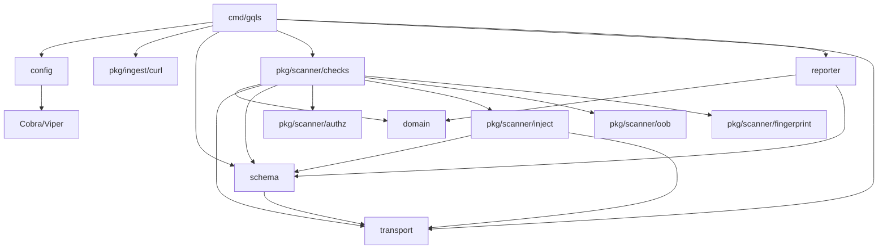

### Component diagram

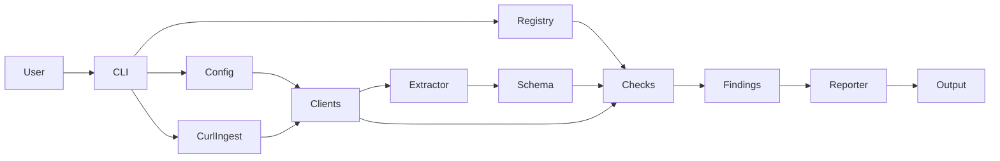

### Execution pipeline

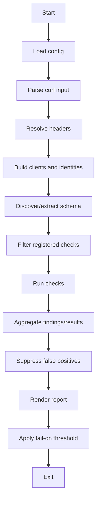

### Data flow

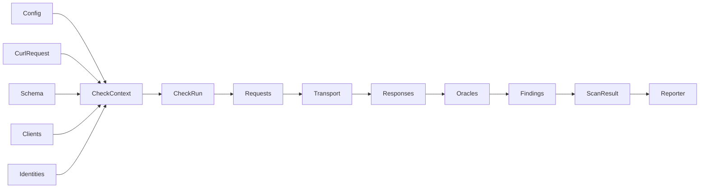

### Module interactions

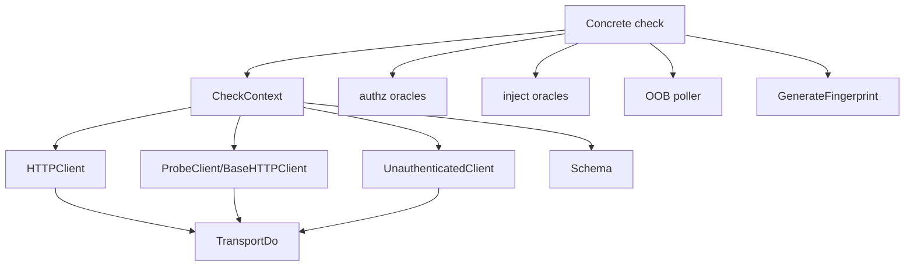

## 12. Mermaid Sequence Diagrams

### CLI startup

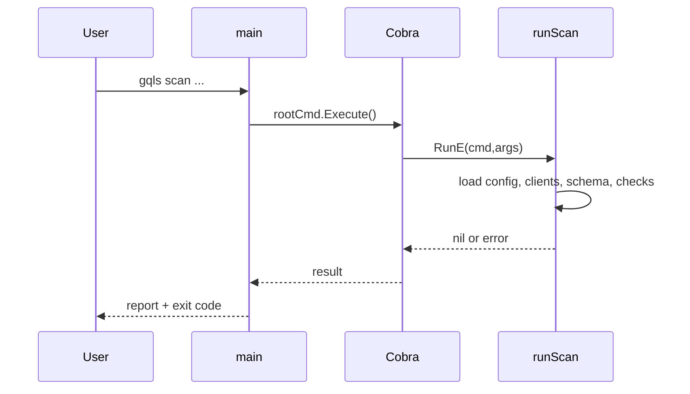

### Schema discovery

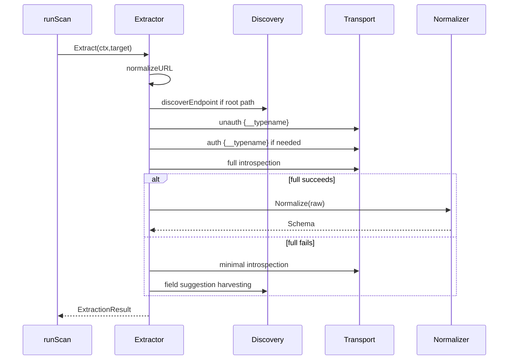

### Request execution

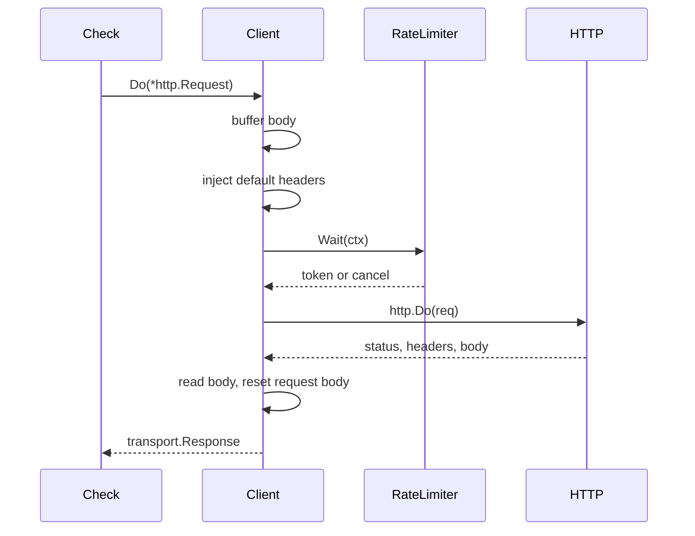

### Authentication/identity flow

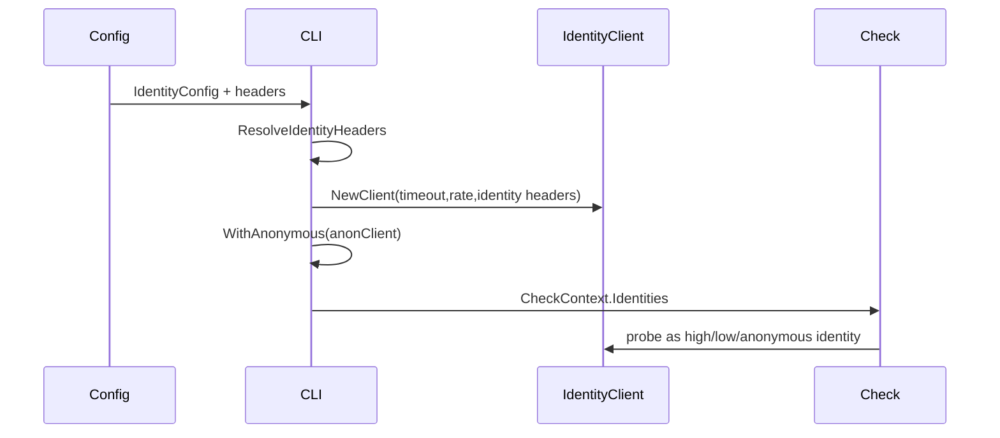

### Scanner workflow

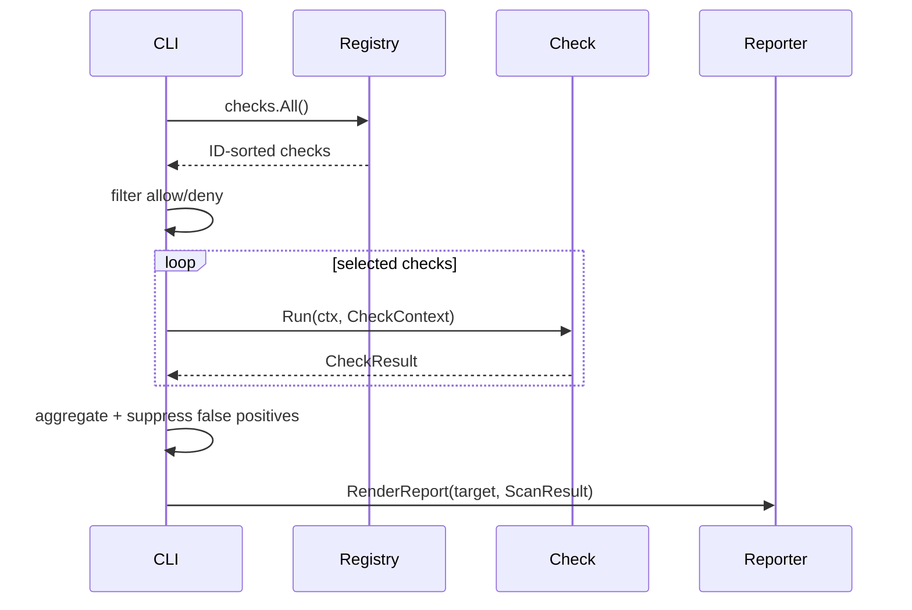

### Report generation

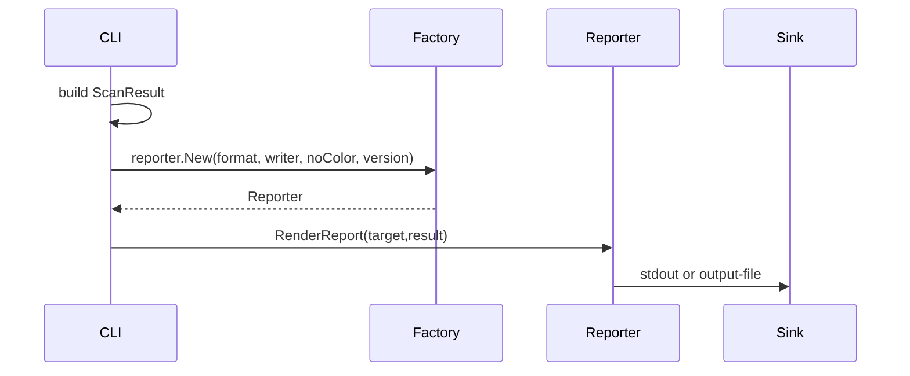

## 13. State Machine

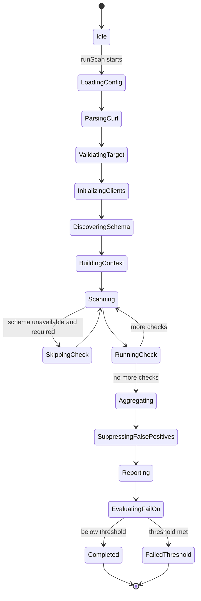

## 14. Call Graph

```text
main()                                      cmd/gqls/main.go        process entrypoint
└── rootCmd.Execute()                       cmd/gqls/scan.go        Cobra dispatch
    └── runScan(cmd,args)                   cmd/gqls/scan.go        scanner lifecycle
        ├── config.Load(v,cmd)              pkg/config/config.go    config defaults/file/env/flags
        │   ├── bindFlag(...)
        │   ├── parseIdentityFlag(...)
        │   ├── canonicalizeIdentityHeaders(...)
        │   ├── dedupeIdentities(...)
        │   └── parseSeedFlag(...)
        ├── applyCurlInput(cmd,cfg)         cmd/gqls/scan.go        optional curl parsing/merge
        │   ├── curlCommandString(cmd)
        │   └── curl.Parse(raw)             pkg/ingest/curl/parser.go
        ├── cfg.ResolveHeaders()            pkg/config/config.go
        ├── transport.NewClient(...)        pkg/transport/client.go full/base/anonymous clients
        ├── buildIdentities(cfg,anon)       cmd/gqls/scan.go
        │   ├── config.ResolveIdentityHeaders(...)
        │   ├── transport.NewClient(...)
        │   └── authz.WithAnonymous(...)
        ├── checks.All()                    pkg/scanner/checks/base.go registry copy/sort
        ├── filterChecks(...)
        ├── schema.NewExtractor(...)
        ├── extractor.Extract(ctx,target)   pkg/schema/extractor.go schema lifecycle
        │   ├── normalizeURL(rawURL)
        │   ├── discoverEndpoint(...)
        │   ├── e.probeAuth(...)
        │   │   └── transport.Client.Do(...)
        │   ├── e.sendIntrospection(...)
        │   │   └── transport.Client.Do(...)
        │   ├── schema.Normalize(raw)
        │   ├── NewHarvester(...).Harvest(...)
        │   └── hasSchemaData(...)
        ├── checks.Check.Run(ctx,checkCtx)  pkg/scanner/checks/*    each selected check
        │   ├── build GraphQL request/payload
        │   ├── choose HTTPClient/ProbeClient/UnauthenticatedClient/identity client
        │   ├── transport.Client.Do(req)
        │   ├── parse response/evaluate oracle
        │   └── return CheckResult{Findings,PassReason,ProbeCount}
        ├── suppressFalsePositives(...)
        ├── reporter.New(format,...)
        ├── rep.RenderReport(target,result)
        └── fail-on threshold check
```

## 15. Extension Guide

### Adding a new check

1. Create `pkg/scanner/checks/gqlXYZ_slug.go` and `gqlXYZ_slug_test.go`.
2. Define a struct and implement `ID`, `Name`, `Category`, `Severity`, `RequiresSchema`, and `Run`.
3. Register it in `init()` with `MustRegister`.
4. Use `CheckContext` correctly:
   - `HTTPClient` when reproducing original/curl/authenticated context;
   - `ProbeClient()`/base client for synthetic probes;
   - `UnauthenticatedClient` for public-access checks;
   - identity clients for differential authz.
5. Keep probes bounded and safe; mutation checks must respect `AllowMutations` and mutation allowlists.
6. Set `ProbeCount`, `PassReason`/`PassProbes` for clean results, and `Fingerprint`, `Confidence`, `CWE`, `OWASP`, `References`, `Impact`, `Remediation` for findings.
7. Run `go test ./...`, `go vet ./...`, and `go build ./cmd/gqls`.

### Adding config

Add a `ScanConfig` field, Viper defaults/bindings/env names, Cobra flag if CLI-facing, docs, tests, and propagation into `CheckContext` if checks need it.

### Adding output formats

Implement `reporter.Reporter`, add a branch to `reporter.New`, add tests, update README/docs.

### Adding schema capabilities

Prefer extending `pkg/schema` or `pkg/schema/surface` rather than embedding schema walking logic in checks. This keeps candidate generation consistent.

## 16. Risks & Technical Debt

- **No transport retries:** transient network failures become check failures or missed findings.
- **Context usage:** many calls use `context.Background()` from `runScan`; global scan cancellation/timeout is not centrally modeled beyond per-request HTTP timeout.
- **Active scan safety:** many DoS/injection checks are bounded, but they still send potentially suspicious payloads. Defaults should remain conservative.
- **Schema dependency:** many high-value checks skip when schema extraction fails.
- **OOB backend:** `oob.Client` is pluggable but default polling returns no hits, so blind OOB value requires external integration.
- **CVE intelligence staleness:** advisory mappings must be curated and dated; stale mappings can mislead users.
- **Report compatibility:** domain JSON fields are public integration surface.

## 17. Missing Documentation

- A generated `gqls.yaml` reference with every config key, env var, and CLI equivalent.
- A check authoring guide with code templates.
- A supported-target safety model explaining which checks send mutations or high-cost documents.
- An OOB backend integration guide.
- A schema extraction troubleshooting guide.
- A report schema contract for JSON/SARIF consumers.

## 18. Glossary

- **Base client**: client carrying CLI headers only, excluding curl-file headers.
- **Full client**: client carrying curl and CLI headers.
- **Unauthenticated client**: client carrying no default headers.
- **Check**: a vulnerability probe implementing `checks.Check`.
- **Finding**: a reported vulnerability with metadata/evidence.
- **Pass probe**: evidence request for a clean/no-finding check result.
- **OOB**: out-of-band callback detection via collaborator-style domains.
- **BOLA/IDOR**: broken object-level authorization / insecure direct object reference.
- **BFLA**: broken function-level authorization.
- **BOPLA**: broken object property-level authorization.
- **SDL**: GraphQL schema definition language.

## 19. Frequently Asked Questions

**How does the scanner actually work?**
It loads configuration, builds clients, extracts a schema, runs registered checks with a shared context, aggregates findings, and renders a report.

**How does data move?**
Config/curl/env data become `ScanConfig`, then clients/schema/identities become `CheckContext`, then checks produce `CheckResult`/`Finding`, then reporters serialize `ScanResult`.

**Where are vulnerabilities detected?**
In `pkg/scanner/checks/*`. Shared evidence/oracle logic lives in `authz`, `inject`, `oob`, `fingerprint`, and `schema/surface`.

**How are requests created?**
Extractor/checks create `http.Request` instances with GraphQL JSON bodies or WebSocket payloads, then send them through `transport.Client` or WS helpers.

**How are responses analyzed?**
Checks parse status codes, JSON `data`/`errors`, headers, latency, body substrings/regexes, identity differentials, and OOB callbacks.

**Where should new features be added?**
New vulnerabilities belong in `pkg/scanner/checks`; reusable GraphQL/schema enumeration belongs in `pkg/schema/surface` or `pkg/scanner/inject`; new output belongs in `pkg/reporter`; new CLI settings belong in `pkg/config` and `cmd/gqls/scan.go`.

**What files are most important?**
`cmd/gqls/scan.go`, `pkg/scanner/checks/base.go`, `pkg/domain/domain.go`, `pkg/transport/client.go`, `pkg/schema/extractor.go`, `pkg/schema/model.go`, and the concrete check files.

**What files should never be modified lightly?**
`pkg/domain/domain.go` (report/API compatibility), `pkg/transport/client.go` (auth/rate/latency semantics), `pkg/scanner/checks/base.go` (registry/context contract), and `cmd/gqls/scan.go` (global lifecycle and safety semantics).

## 20. Suggested Next Reading Order for the Codebase

1. `README.md` for user intent.
2. `cmd/gqls/main.go` and `cmd/gqls/scan.go` for lifecycle.
3. `pkg/domain/domain.go` for shared result types.
4. `pkg/config/config.go` for input/config semantics.
5. `pkg/transport/client.go` and `pkg/transport/ws.go` for request execution.
6. `pkg/schema/model.go`, `pkg/schema/extractor.go`, `pkg/schema/normalizer.go`, and `pkg/schema/harvester.go` for discovery.
7. `pkg/scanner/checks/base.go` for the check contract.
8. Start with simple checks (`gql001`, `gql003`, `gql010`), then schema checks (`gql006`), then authz (`gqla*`), injection (`gqli*`), DoS (`gqld*`), and misconfiguration (`gqlm*`).
9. Read tests next to each check; tests are the most precise behavioral examples.
10. Read `docs/tickets/*.md` for product/security intent and acceptance criteria.
